# CryptoPal

A cryptocurrency trading simulator with an AI account assistant. Real prices from Binance,
simulated trades against a virtual balance, and a Gemini-backed assistant that answers
questions about your own account.

Built solo as an i2i term project.

[](https://github.com/KenanOzcakir/CryptoPal1/actions/workflows/ci.yml)


## Live demo

**http://35.246.229.20** and the API documentation at
**http://35.246.229.20/swagger-ui.html**

Register with any email and you get a randomized virtual balance to trade with, against live
Binance prices. The money is imaginary and the prices are not.

Two honest notes. It is **http, not https**: TLS needs a domain, and that is the first thing I
would add next. And it runs on one small box in Frankfurt, so it is a demonstration rather
than a service.

## Objective

Build a modular backend that has to get several things right at once: real external market
data, a fast cache, a durable source of truth, money arithmetic that cannot drift,
concurrency that cannot lose a balance, and an AI integration that never invents a number.
The trading is simulated so the interesting problems stay in the engineering rather than in
the finance.

**No order placed here ever reaches an exchange.** Binance is read as a price feed and
nothing else. All balances are play money.

## What it does

1. You register and receive a randomized starting balance between $10,000 and $100,000 in
   virtual USD.
2. You watch real BTC, ETH, SOL and XRP prices, refreshed every 15 seconds.
3. You buy and sell against those prices. Trades are simulated but the arithmetic is real.
4. You track a portfolio valued at the latest prices, and a full trade history.
5. You ask an assistant about your account, and it answers from your actual data.

## Features

| Feature | Detail |
|---|---|
| Accounts | Register, log in, log out. Passwords hashed with BCrypt |
| Sessions | Opaque random tokens in Redis with a TTL. Logout revokes immediately |
| Live prices | Binance Spot API, all four assets in one batched call, refreshed every 15s |
| Offline fallback | If Binance fails, a local ticker engine takes over automatically so prices never stop |
| Trading | Buy and sell in one transaction under a wallet row lock, so concurrent orders cannot corrupt a balance |
| Portfolio | Cash, positions valued at live prices, total, and recent trades |
| AI assistant | Gemini, called only from the backend, grounded in your account data and told not to invent figures |
| API docs | Swagger UI generated from the code |

## Screenshots

**Market.** Live rates from Binance, refreshed every 15 seconds. Market cap and the 1 hour and
7 day changes are missing on purpose: Binance is an exchange rather than an aggregator and does
not publish them, and inventing them in an app about money seemed worse than leaving them out.

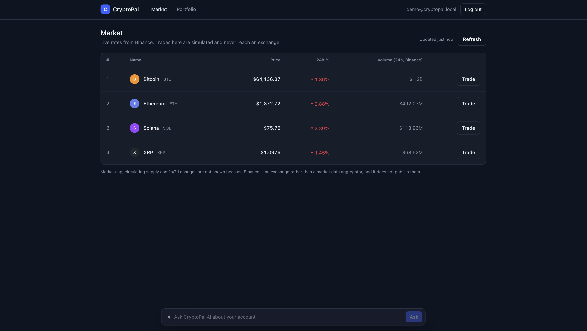

**Trading.** `amount` means different things depending on the side, so the label, the unit
inside the field and the live preview all change with the tab. The order fills against the
cached price and returns the balance and position that result, so the screen never has to guess.

| Placing a buy | Filled |
|---|---|
| 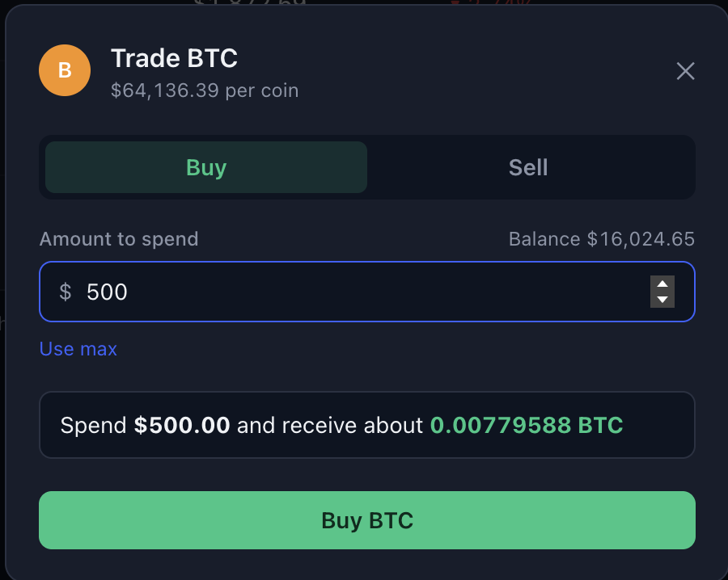 | 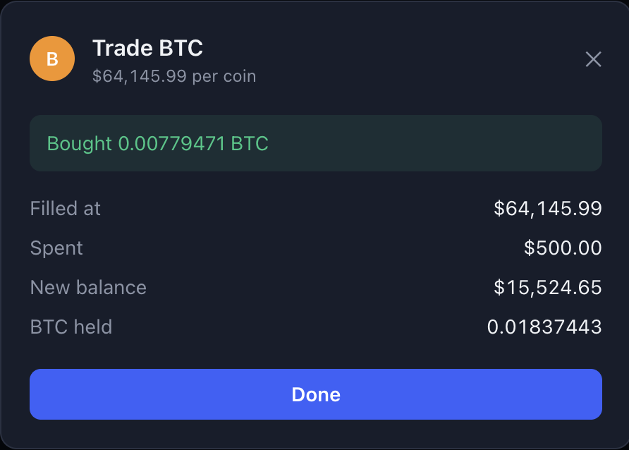 |

**Portfolio.** Cash, positions valued at the latest prices, the total, and the full trade
history. Everything except cash is an estimate, and the page says so.

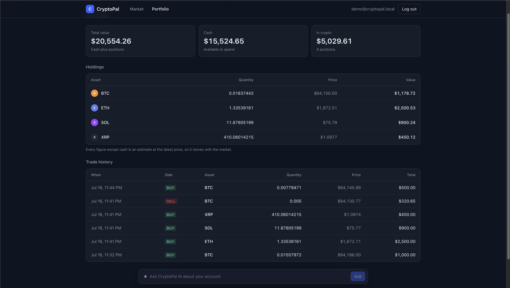

**The assistant.** Answers from this account's own data, with the percentages computed in Java
rather than by the model. It is told to describe the figures it is given and never to invent or
recompute one.

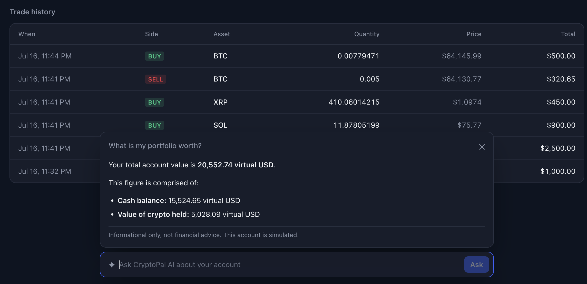

**API documentation.** Generated from the controllers by springdoc, so it cannot drift away from
what the code actually does.

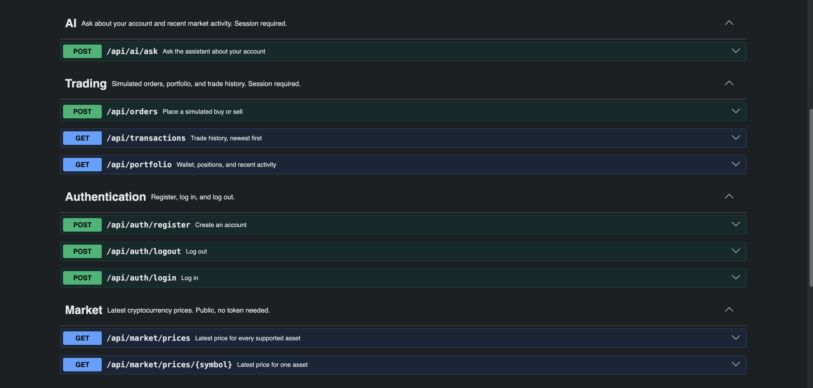

## Technologies

| Area | Choice |
|---|---|
| Backend | Java 17, Spring Boot 4.1.0, Maven |
| Frontend | React 19, TypeScript, Vite 8, Tailwind CSS 4 |
| Database | PostgreSQL 17, Flyway migrations |
| Cache | Redis 8 |
| Market data | Binance Spot API (`/api/v3/ticker/24hr`) |
| AI | Google Gemini (`gemini-3.1-flash-lite`) |
| API docs | springdoc-openapi 3.0.3 |
| Infrastructure | Docker Compose |

Why each of these, and what was rejected, is in [DESIGN_CHOICES.md](DESIGN_CHOICES.md).

### Backend dependencies

All version-managed by the Spring Boot parent except springdoc.

```text
spring-boot-starter-webmvc          REST controllers, JSON, embedded Tomcat
spring-boot-starter-data-jpa        Hibernate, entities, repositories
spring-boot-starter-data-redis      RedisTemplate for sessions and prices
spring-boot-starter-validation      Bean Validation on request DTOs
spring-boot-starter-actuator        /actuator/health
spring-boot-starter-webclient       WebClient for Binance and Gemini
spring-boot-starter-flyway          Migrations, and the auto-configuration that runs them
spring-security-crypto              BCrypt only, not the full security starter
flyway-database-postgresql          Flyway's PostgreSQL dialect
postgresql                          JDBC driver
springdoc-openapi-starter-webmvc-ui Swagger UI (3.x is the Spring Boot 4 line)
```

### Frontend dependencies

```text
react, react-dom                    UI
react-router-dom                    Routing
@tanstack/react-query               Polling and async state
react-markdown                      Renders the assistant's Markdown answers safely
tailwindcss, @tailwindcss/vite      Styling
typescript, vite                    Build and typecheck
```

## Requirements

- JDK 17 or newer
- Maven 3.9+
- Node 20+ and npm
- Docker and Docker Compose
- A Google Gemini API key, free from https://aistudio.google.com/apikey (optional: the app
  runs without one, only the assistant is disabled)

## Setup

```bash
git clone https://github.com/KenanOzcakir/CryptoPal1.git
cd CryptoPal1

# 1. Configuration. .env is gitignored and never committed.
cp .env.example .env

# 2. Put your Gemini key in .env if you want the assistant:
#    GEMINI_API_KEY=your_key_here

# 3. Start PostgreSQL and Redis
docker compose up -d
docker compose ps          # both should say (healthy)
```

Flyway creates the schema automatically the first time the backend starts. There is no
manual database setup.

## Running it

Three terminals, or background the first two.

```bash
# Terminal 1: backend on :8080
cd backend
mvn spring-boot:run

# Terminal 2: frontend on :5173
cd frontend
npm install
npm run dev
```

Then open **http://localhost:5173**, register an account, and trade.

| URL | What |
|---|---|
| http://localhost:5173 | The app |
| http://localhost:8080/swagger-ui.html | API documentation |
| http://localhost:8080/actuator/health | Health check |
| http://localhost:8080/v3/api-docs | Raw OpenAPI document |

## Building

```bash
# Backend: runs the tests, then produces a runnable jar
cd backend
mvn clean package
java -jar target/cryptopal-backend-0.1.0-SNAPSHOT.jar

# Frontend: typechecks, then builds into frontend/dist
cd frontend
npm run build
```

## Testing

```bash
docker compose up -d      # required: the tests use real PostgreSQL and Redis
cd backend
mvn test
```

**97 tests, 0 failures.** They never call Binance or Gemini: the outbound clients are
stubbed, so the suite needs no network and spends no tokens.

The tests worth knowing about:

| Test | What it proves |
|---|---|
| `concurrentBuysCannotOverdrawTheWallet` | Fires 20 orders of $100 at a $1,000 wallet at once. Exactly 10 succeed and the balance lands on $0.00. Remove the lock and it fails immediately |
| `whenTheTradeLogCannotBeWrittenTheMoneyDoesNotMove` | Breaks the trade log mid-order and checks the balance is untouched |
| `buyingRoundsTheQuantityDownSoValueIsNeverInvented` | What you receive is worth no more than what you paid |
| `loggingOutKillsTheTokenImmediately` | The token is gone from Redis and refused on the next call |
| `aWrongPasswordAndAnUnknownEmailAreIndistinguishable` | Login cannot be used to discover which emails have accounts |
| `theSessionActuallyLivesInRedisAndCarriesATtl` | Redis is genuinely doing the work |

## Usage

Register, and you land on the market page.

| Action | How |
|---|---|
| See prices | The market page polls every 15 seconds. "Refresh" forces it |
| Buy | Trade on any row, Buy tab, enter **dollars to spend** |
| Sell | Trade on a row you hold, Sell tab, enter **quantity of coin** |
| Portfolio | Cash, positions, total, and every trade |
| Ask the AI | The bar at the bottom. Focus it for suggested questions |
| Log out | Top right. The token dies server-side, not just in the browser |

## Rules and behaviour worth knowing

**The `amount` field means different things depending on `side`.** This is the single most
important rule in the API:

- **BUY**: `amount` is the **fiat to spend**. `100` means "spend 100 dollars".
- **SELL**: `amount` is the **quantity of crypto**. `0.5` means "sell half a coin".

They are not interchangeable. Sending `1000` to a SELL asks to sell a thousand whole coins.
The UI makes this hard to get wrong: the label, the unit inside the field and a live preview
all change with the tab, and switching tabs clears the number.

Other behaviour that is deliberate rather than accidental:

- **Buy quantity always rounds down** at 8 decimals. Rounding can never hand out more coin
  than was paid for.
- **Every money value is a `BigDecimal`.** Nothing touches a float.
- **Prices expire after 60 seconds.** If refreshes stop, the API answers `PRICE_UNAVAILABLE`
  rather than letting trades run against a stale number.
- **An unknown path under `/api/` returns 401, not 404**, because the session filter decides
  before the router does. The API surface cannot be mapped by probing.
- **Redis holds nothing durable.** Losing it logs everyone out and drops the price cache.
  Nothing else.
- **Market prices are public.** Everything else needs a session.
- **The Gemini key never leaves the server.** The browser has no way to reach Gemini.
- **The app runs without a Gemini key.** Only `/api/ai/ask` degrades.
- **The assistant is capped**, at 20 questions per person and 300 in total per rolling day,
  because Gemini's capacity is the one thing here I do not own. Crossing either answers
  `RATE_LIMITED` (429) and nothing else in the app is affected. Nothing else is rate limited.

## Expected result

A working simulator. A real round trip from the running app looks like this:

```text
BUY   0.01563232 BTC @ 63,970.00  = $1,000.00
SELL  0.01563232 BTC @ 63,972.13  = $1,000.03
```

Balance moved 84,401.00 to 84,401.03. BTC rose $2.13 between the two orders and the
simulator paid out exactly that, three cents. Then the assistant, asked about it:

> Your total account value is **84,401.03 virtual USD**. Currently, you hold no crypto...
> This trade resulted in a gain of **0.03 virtual USD**.
> Please note that this is a simulated account using play money for educational purposes.

## API

Full contract in [API_CONTRACT.md](API_CONTRACT.md), live docs at `/swagger-ui.html`.

```text
POST   /api/auth/register     public
POST   /api/auth/login        public
POST   /api/auth/logout       session
GET    /api/market/prices     public
GET    /api/market/prices/{symbol}  public
POST   /api/orders            session
GET    /api/portfolio         session
GET    /api/transactions      session
POST   /api/ai/ask            session
```

Every failure returns the same shape, so the frontend handles errors once:

```json
{ "message": "Insufficient funds to complete this trade",
  "code": "INSUFFICIENT_FUNDS",
  "timestamp": "2026-07-16T12:00:00Z" }
```

Branch on `code`, never on `message`.

## Structure

```text
CryptoPal1/
├── backend/
│   ├── Dockerfile          multi-stage: a JDK compiles, a JRE runs
│   ├── pom.xml
│   └── src/
│       ├── main/java/com/cryptopal/
│       │   ├── CryptoPalApplication.java   entry point, enables scheduling
│       │   ├── common/    error contract, Swagger. Depends on nothing else
│       │   ├── auth/      register, login, sessions, User, Wallet, the auth filter
│       │   ├── market/    price providers, the 15s refresh, Redis cache, snapshots
│       │   ├── trading/   buy, sell, portfolio, MoneyMath, Holding, Transaction
│       │   └── ai/        Gemini client, prompt builder, insight endpoint
│       ├── main/resources/
│       │   ├── application.yml
│       │   └── db/migration/V1__initial_schema.sql
│       └── test/java/com/cryptopal/        97 tests
├── frontend/
│   ├── Dockerfile          Node builds the SPA, nginx serves it
│   ├── nginx.conf          serves the SPA, proxies /api to the backend
│   └── src/
│       ├── api/           client and types, mirrors the backend DTOs
│       ├── components/    shared UI
│       ├── features/      auth, market, trading, portfolio, ai-chat
│       ├── lib/           number formatting
│       ├── state/         auth context
│       ├── App.tsx        routes and shell
│       └── main.tsx       providers
├── diagrams/              architecture, order flow, and a class diagram per module
├── screenshots/           the running app
├── docker-compose.yml     PostgreSQL and Redis only, for development
├── docker-compose.prod.yml   all four containers, for a deployed box
├── .env.example           configuration template
├── API_CONTRACT.md
├── DESIGN_CHOICES.md
├── LICENSE
└── README.md
```

The backend is one deployable, split into feature packages rather than into layers. Each
package holds its own controller, services, entities and repositories. `common` is the only
package the others may depend on, and it depends on none of them.

## Diagrams

### How the pieces fit together

The browser only ever talks to one origin, which is why there is no CORS configuration
anywhere in this project. Binance is read every 15 seconds in one batched call and is never
written to. Redis holds only what it can afford to lose, and PostgreSQL is the source of
truth. The Gemini key lives on the backend and has no path to the browser.

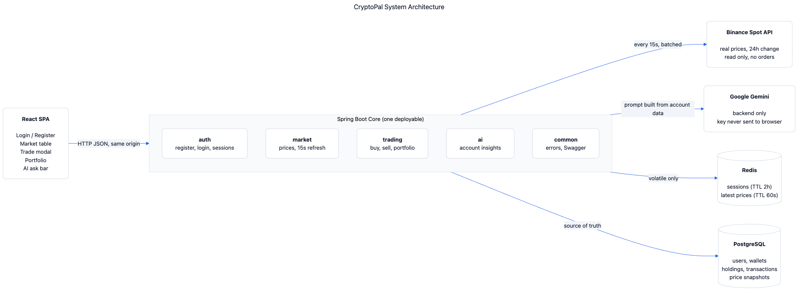

### A buy order, end to end

This is the most important picture here, because it is where the money moves and where it
could quietly go wrong. Four things in it are deliberate.

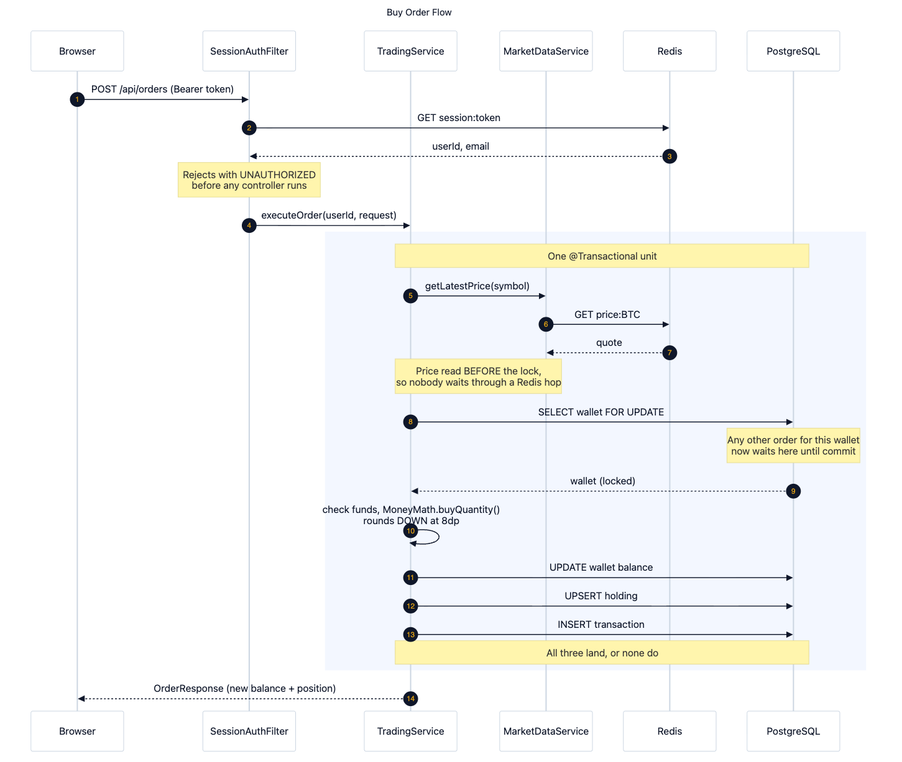

**Step 8, `SELECT wallet FOR UPDATE`.** This is the decision the whole project turns on.
`@Transactional` alone does **not** prevent a lost update: under PostgreSQL's default READ
COMMITTED isolation, two concurrent orders can both read a balance of 1,000, both decide 100
is affordable, and both write 900. One order's money vanishes and **no error is raised
anywhere**. The lock makes the second order wait until the first commits and then read the
truth. A test fires twenty $100 orders at a $1,000 wallet at once and asserts exactly ten
succeed. Remove this one line and it fails immediately.

**Steps 5 to 7, the price is read before the lock is taken.** That ordering is not incidental.
The price read is a Redis round trip, and doing it while holding the lock would make every
other order for the same wallet queue behind a network hop for no reason.

**Step 10, the quantity rounds down.** At 8 decimal places, always downward, so a rounding
error can never hand out more coin than was paid for. Value is never created out of nothing.

**Steps 11 to 13, all three writes land or none do.** The balance, the position and the trade
log are one unit. A trade log that failed after the money moved would leave a balance nobody
could explain.

And before any of that, at step 2: the session filter answers first, which is why an unknown
path under `/api/` returns 401 rather than 404. The API surface cannot be mapped by probing.

### One class diagram per module

The backend is split by feature rather than by layer, so each of these is one module's whole
story: its controller, services, entities and repositories together.

**auth.** Registration, login, sessions, and the filter that judges them. The filter lives here
rather than in `common` because `auth` issues sessions, so `auth` is what should judge them.
`Wallet` sits here for the same reason: registration creates it.

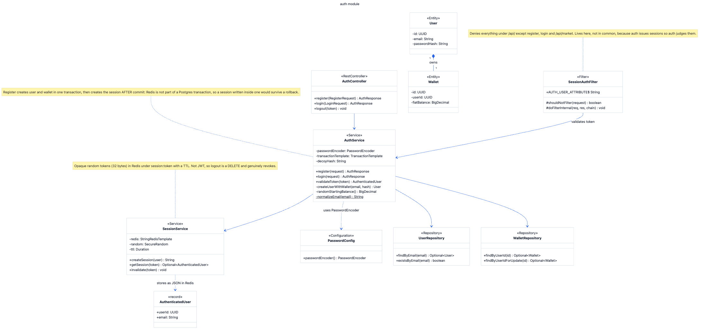

**market.** The provider seam is the point of this one. `MarketDataProvider` has one method and
two implementations, and the service falls back from Binance to the local ticker engine on its
own, so a dead network never leaves a demo with an empty screen.

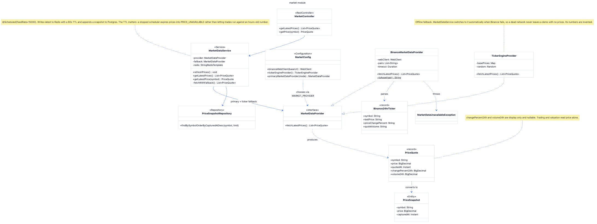

**trading.** Orders, positions, history, and `MoneyMath`, which is where every rounding rule
lives so that no arithmetic is invented at the call site.

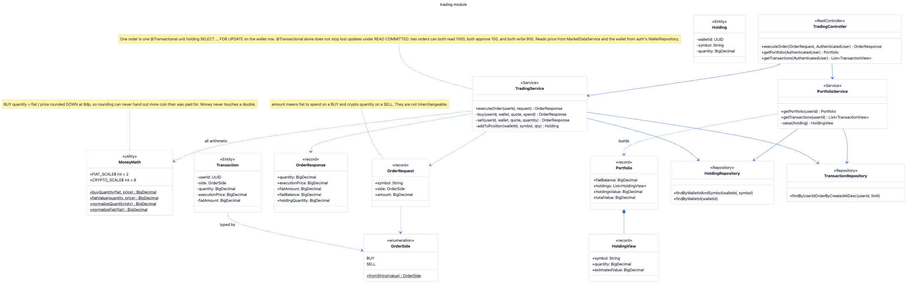

**ai.** The client, the prompt builder, and the endpoint. The prompt puts instructions first
and the user's question last, fenced and labelled as the user's words, because pasting user
text straight into a brief invites it to be read as an instruction.

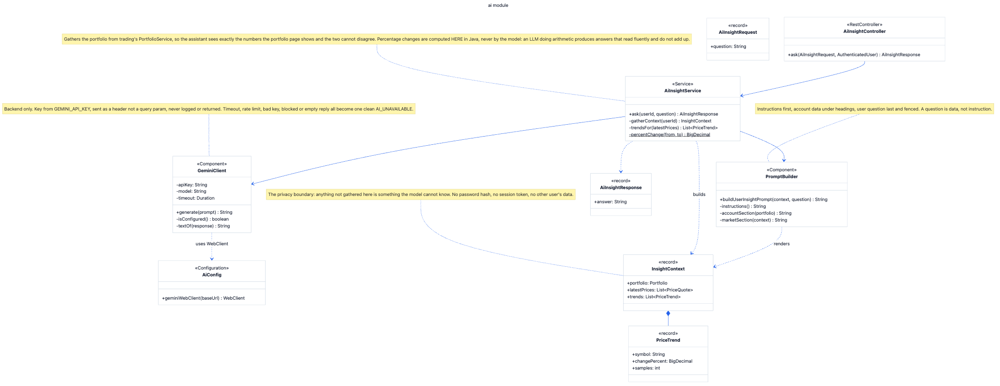

Sources are the `.mmd` files beside each one, so these are regenerated rather than redrawn.

## Configuration

Everything is read from the environment. Nothing is hardcoded and no secret is committed.

| Variable | Purpose |
|---|---|
| `POSTGRES_DB`, `POSTGRES_USER`, `POSTGRES_PASSWORD` | Database |
| `DATABASE_URL` | JDBC URL |
| `REDIS_HOST`, `REDIS_PORT` | Cache |
| `SESSION_TTL_MINUTES` | How long a session lives. Default 120 |
| `MARKET_PROVIDER` | `binance` (default) or `ticker` to run offline |
| `BINANCE_BASE_URL`, `SUPPORTED_SYMBOLS` | Market data |
| `GEMINI_API_KEY` | The assistant. Backend only |
| `GEMINI_MODEL` | Default `gemini-3.1-flash-lite` |
| `VITE_API_BASE_URL` | Where the dev server proxies `/api` |

## Checklist

- [x] Register, log in, log out
- [x] Randomized starting balance
- [x] Live prices from a real exchange, refreshed every 15 seconds
- [x] Redis for sessions and the latest prices only
- [x] PostgreSQL as the source of truth, with Flyway migrations
- [x] Buy and sell, transactional, with a wallet lock
- [x] Insufficient funds and insufficient holdings rejected
- [x] Portfolio and trade history
- [x] AI answers about the account, backend only
- [x] Errors handled cleanly and consistently
- [x] Docker Compose for the infrastructure
- [x] Swagger documentation
- [x] Frontend with loading and error states
- [x] No secrets committed
- [x] 97 tests passing
- [x] Screenshots
- [x] Deployment to a VM (GCP e2-medium, Frankfurt)

## Licence

MIT. See [LICENSE](LICENSE). Free to use for learning and reference.
